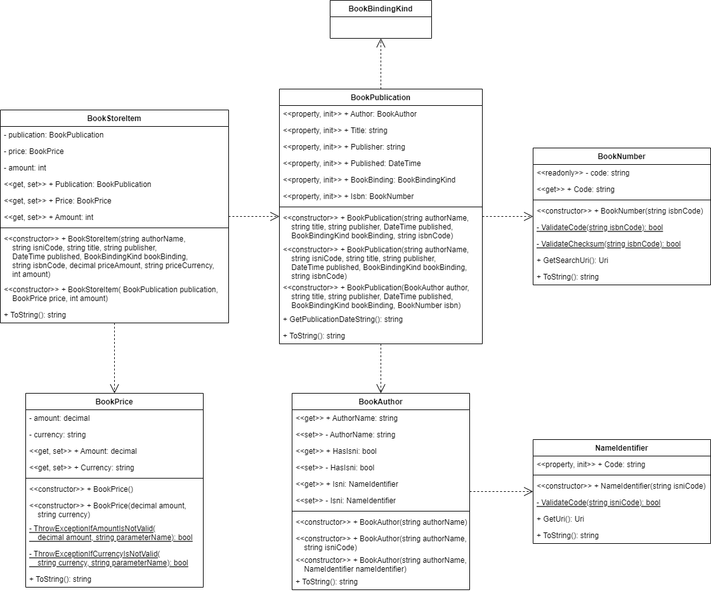

# Book Store Catalog

Intermediate level task for practicing object-oriented design and class declaration.

Before starting with the task learn the basics of [UML language](https://en.wikipedia.org/wiki/Unified_Modeling_Language) and [UML Class Diagrams](https://en.wikipedia.org/wiki/Class_diagram). Search YouTube for [relevant video tutorials](https://www.youtube.com/results?search_query=uml+class+diagram) to get started quickly. Don't waste time! You don't have to master class diagrams. You just need to get a [basic understanding on the topic](https://www.tutorialspoint.com/object_oriented_analysis_design/ooad_uml_basic_notation.htm), and you can always find the answer to your question in the [UML Class Diagrams Reference](https://www.uml-diagrams.org/class-reference.html).

Estimated time to complete the task - 1.5h.

The task requires .NET 6 SDK installed.


## Task Description

In this task you have to implement few classes that represents a bookstore item. Each bookstore item has these attributes:
* A name of a book author.
* An [International Standard Name Identifier (ISNI)](https://en.wikipedia.org/wiki/International_Standard_Name_Identifier) that uniquely identifies a book author (optional attribute).
* A book title.
* A name of a publisher who published a book.
* A book publication date.
* An [International Standard Book Number (ISBN)](https://en.wikipedia.org/wiki/ISBN) that uniquely identifies a publication.
* A book binding type.
* A book price.
* A currency of a book price.
* An amount of available books in a store.

Possible design of the class is shown on the class diagram below.




### Validation Rules

A book author name, a book title and a book publisher attributes must have at least one letter character.

A valid ISNI attribute must follow these rules:
* An ISNI code string must have sixteen characters.
* Each character is either a digit or "X" character (represents 10).

A valid ISBN attribute must follow these rules:
* An ISBN code string must have ten characters.
* Each character is either a digit or "X" character (represents 10).
* An [ISBN-10 checksum](https://en.wikipedia.org/wiki/ISBN#ISBN-10_check_digits) is valid.

To calculate the ISBN-10 checksum, use this formula:

$`checksum = \sum_{i=1}^{10}(11-i)x_i=x_1·10+x_2·9+x_3·8+x_4·7+x_5·6+x_6·5+x_7·4+x_8·3+x_9·2+x_{10}·1`$,

where $`x_i`$ is the *i*th digit.

If the `checksum % 11` equals 0, then the given ISBN code is valid.

The currency attribute must follow these rules:
* A currency string must have three characters.
* Each character is a letter.

The price and amount attributes are valid, if an attribute value is greater or equals zero.


### Nullable Context

The [nullable annotation and warning contexts](https://docs.microsoft.com/en-us/dotnet/csharp/nullable-references#nullable-contexts) are disabled for both [BookStoreCatalog](BookStoreCatalog/BookStoreCatalog.csproj) and [BookStoreCatalog.Tests](BookStoreCatalog.Tests/BookStoreCatalog.Tests.csproj) projects.

```xml
<Project Sdk="Microsoft.NET.Sdk">
  <PropertyGroup>
    ...
    <Nullable>disable</Nullable>
    ...
```

When a *nullable annotation context* is set to `disable`, the compiler behaves similarly to C# 7.3 and earlier:
* Nullable warnings are disabled.
* All reference type variables are [nullable reference types](https://docs.microsoft.com/en-us/dotnet/csharp/nullable-references).
* You can't declare a variable as a nullable reference type using the `?` suffix on the type.
* You can use the [null forgiving operator](https://docs.microsoft.com/en-us/dotnet/csharp/language-reference/operators/null-forgiving), `!`, but it has no effect.

Since the *nullable annotation context* is disabled, add [guard clauses](https://www.google.com/search?q=guard+clause) to your classes that will check input constructor and method arguments for `null`.

Use the invariant culture settings for string formatting.


### BookNumber Class

Implement a class that represents an ISBN.

Add a new [public](https://docs.microsoft.com/en-us/dotnet/csharp/programming-guide/classes-and-structs/access-modifiers) class to the [BookNumber.cs](BookStoreCatalog/BookNumber.cs) file. The class must fulfill these requirements:
* The class must have the same name as the file name.
* The class must be [immutable](https://en.wikipedia.org/wiki/Immutable_object).
* Field
    * The class must have a private [readonly](https://docs.microsoft.com/en-us/dotnet/csharp/language-reference/keywords/readonly) field `code` to store a 10-digit ISBN code. The field type must be `string`.
* Static Methods
    * The class must have the private static method `ValidateCode` to validate the ISBN code. The method must return `true` if the `isbnCode` method argument has a valid ISBN code.
    * The class must have the private static method `ValidateChecksum` to calculate a ISBN-10 checksum and validate the ISBN code. The method must return `true` if the `isbnCode` method argument has an ISBN code with the valid checksum.
* Property
    * The class must have the property `Code` to access the `code` field. The property must have only the public [get accessor](https://docs.microsoft.com/en-us/dotnet/csharp/programming-guide/classes-and-structs/using-properties#the-get-accessor).
* Constructor
    * The class must have a public [constructor](https://docs.microsoft.com/en-us/dotnet/csharp/programming-guide/classes-and-structs/constructors) with `isbnCode` parameter that must initialize the `code` field with the given argument.
    * The constructor must use the `ValidateCode` and `ValidateChecksum` methods to validate a `isbnCode` argument.
    * Add a guard clause to throw an [ArgumentNullException](https://docs.microsoft.com/en-us/dotnet/api/system.argumentnullexception) in case the `isbnCode` argument is `null`.
* Instance Methods
    * The class must have the `GetSearchUri` method that must return an [Uri](https://docs.microsoft.com/en-us/dotnet/api/system.uri) object that is initialized with the link to a relevant search page on the [isbnsearch.org](https://isbnsearch.org/) website.
    * The class must override [ToString](https://docs.microsoft.com/en-us/dotnet/api/system.object.tostring) method to return the value of the `code` field.


### BookPrice Class

Implement a class that represents a book price.

Add a new public class to the [BookPrice.cs](BookStoreCatalog/BookPrice.cs) file. The class must fulfill these requirements:
* The class must have the same name as the file name.
* Fields
    * The class must have a private field `amount` to store an amount of money a book costs. The field type must be `decimal`.
    * The class must have a private field `currency` to store the price currency. The field type must be `string`.
* Static Methods
    * The class must have the private static method `ThrowExceptionIfAmountIsNotValid` that must throw an exception in case the `amount` method argument is not valid.
    * The class must have the private static method `ThrowExceptionIfCurrencyIsNotValid` that must throw an exception in case the `currency` method argument is not valid.
* Properties
    * The class must have the public property `Amount` to access the `amount` field. The property must have both public get and set accessors.
    * The class must have the public property `Currency` to access the `currency` field. The property must have both public get and set accessors.
    * The set accessor of the `Amount` property must use the `ThrowExceptionIfAmountIsNotValid` method to validate the accessor value.
    * The set accessor of the `Currency` property must use the `ThrowExceptionIfCurrencyIsNotValid` method to validate the accessor value.
* Constructors
    * The class must have a public [parameterless constructor](https://docs.microsoft.com/en-us/dotnet/csharp/programming-guide/classes-and-structs/instance-constructors#parameterless-constructors) that must initialize a class object with default values. The default value for `amount` field is "0" and the default value for `currency` is "USD".
    * The class must have a constructor with `amount` and `currency` parameters. The constructor must validate the constructor arguments and initialize the `amount` and `currency` fields with the given arguments.
    * The constructor with parameters must use the `ThrowExceptionIfAmountIsNotValid` and `ThrowExceptionIfCurrencyIsNotValid` methods to validate the constructor arguments.
    * To remove the code duplication, use the [constructor chaining approach](https://www.google.com/search?q=constructor+chaining+in+c%23).
* Instance Methods
    * The class must override [ToString](https://docs.microsoft.com/en-us/dotnet/api/system.object.tostring) method. The method must return the string with the values of the `amount` and `currency` fields - "1,234.56 EUR".


### NameIdentifier Class

Implement a class that represents an ISNI.

Add a new public class to the [NameIdentifier.cs](BookStoreCatalog/NameIdentifier.cs) file. The class must fulfill these requirements:
* The class must have the same name as the file name.
* The class must be immutable.
* Static Methods
    * The class must have the private static method `ValidateCode` to validate the ISNI code. The method must return `true` if the `isniCode` method argument has a valid ISNI code.
* Properties
    * The class must have the public [auto-implemented property](https://docs.microsoft.com/en-us/dotnet/csharp/programming-guide/classes-and-structs/auto-implemented-properties) `Code`. The property must have both get and [init accessors](https://docs.microsoft.com/en-us/dotnet/csharp/programming-guide/classes-and-structs/using-properties#the-init-accessor). The property type must be `string`.
* Constructor
    * The class must have a public constructor with `isniCode` parameter. The constructor must validate the ISNI code and initialize the `Code` property with the given argument.
    * The constructor must use the `ValidateCode` method to validate a `isniCode` argument.
    * Add a guard clause to throw an `ArgumentNullException` in case the `isniCode` argument is `null`.
* Instance Methods
    * The class must have the `GetUri` method that must return an *Uri* object that is initialized with the link to an author page on the [isni.org](https://isni.org/) website.
    * The class must override `ToString` method to return the value of the `code` field.


### BookAuthor Class

Implement a class that represents a book author.

Add a new public class to the [BookAuthor.cs](BookStoreCatalog/BookAuthor.cs) file. The class must fulfill these requirements:
* The class must have the same name as the file name.
* The class must be immutable.
* Properties
    * The class must have the `AuthorName` auto-implemented property. The property type must be `string`.
    * The class must have the `HasIsni` auto-implemented property. The property type must be `bool`.
    * The class must have the `Isni` auto-implemented property. The property type must be `NameIdentifier`.
    * All properties must have the public get and private set accessors. 
* Constructor
    * The class must have a public constructor with `authorName` parameter that validates the `authorName` argument and initializes the `authorName` field with the given argument. The `authorName` argument is not valid, if the argument is empty or has only white-space characters. The method must set the `HasIsni` property to `false`.
    * The class must have a public constructor with `authorName` and `isniCode` parameters that validates the `authorName` argument and initializes the `authorName` field with the given argument. The method must set the `HasIsni` property to `true` and initialize the `Isni` property with a new object of the `NameIdentifier` class.
    * The class must have a public constructor with `authorName` and `isni` parameters that validates the `authorName` argument and initializes the `authorName` field with the given argument. The method must set the `HasIsni` property to `true` and set the `Isni` property to the `isni` argument.
    * Add a guard clause to throw an `ArgumentNullException` in case the `authorName` or `isni` argument is `null`.
    * To remove the code duplication, use the constructor chaining approach.
* Instance Methods
    * The class must override `ToString` method to return the string representation of an object. If a ISNI is not set, the `ToString` method must return a value of the `AuthorName` property. If a ISNI is set, the `ToString` method must return values of the `AuthorName` and `Isni` properties - "Edgar Allan Poe (ISNI:0000000121354025)".


### BookPublication Class

Implement a class that represents a book publication.

Add a new public class to the [BookPublication.cs](BookStoreCatalog/BookPublication.cs) file. The class must fulfill these requirements:
* The class must have the same name as the file name.
* Properties
    * The class must have the `Author` auto-implemented property. The property type must be `BookAuthor`.
    * The class must have the `Title` auto-implemented property. The property type must be `string`.
    * The class must have the `Publisher` auto-implemented property. The property type must be `string`.
    * The class must have the `Published` auto-implemented property. The property type must be `DateTime`.
    * The class must have the `BookBinding` auto-implemented property. The property type must be [BookBindingKind](BookStoreCatalog/BookBindingKind.cs) enum.
    * The class must have the `Isbn` auto-implemented property. The property type must be `BookNumber`.
    * All properties must have the public get and init accessors.
* Constructor
    * The class must have three public constructors.
    * The class must have a constructor to initialize an object with `authorName`, `title`, `publisher`, `published`, `bookBinding` and `isbnCode` arguments.
    * The class must have a constructor to initialize an object with `authorName`, `isniCode`, `title`, `publisher`, `published`, `bookBinding` and `isbnCode` arguments.
    * The class must have a constructor to initialize an object with `author`, `title`, `publisher`, `published`, `bookBinding` and `isbn` arguments.
    * Add guard clauses to throw an `ArgumentNullException` if any of the constructor arguments is `null`.
    * Add guard clauses to throw an `ArgumentException` if the `title` or `publisher` argument is empty or contains only white-space characters.
    * To remove the code duplication, use the constructor chaining approach.
* Instance Methods
    * The class must have the `GetPublicationDateString` method that must return the `published` date as a string - "November, 1966".
    * The class must override `ToString` method to return the string representation of an object - "Complete Stories and Poems of Edgar Allan Poe by Edgar Allan Poe".


### BookStoreItem Class

Implement a class that represents an item in a book store.

Add a new public class to the [BookStoreItem.cs](BookStoreCatalog/BookStoreItem.cs) file. The class must fulfill these requirements:
* The class must have the same name as the file name.
* Fields
    * The class must have a private field `publication` to store an object of the `BookPublication` type.
    * The class must have a private field `price` to store an object of the `BookPrice` type.
    * The class must have a private field `amount` to store the amount of books. The field type must be `int`.
* Constructor
    * The class must have two public constructors.
    * The class must have a constructor to initialize an object with the `authorName`, `isniCode`, `title`, `publisher`, `published`, `bookBinding`, `isbn`, `priceAmount`, `priceCurrency` and `amount` parameters. The constructor must initialize new `BookPublication` and `BookPrice` objects using the given arguments.
    * The class must have a constructor to initialize an object with the `publication`, `price` and `amount` parameters.
    * Add guard clauses to throw an `ArgumentNullException` if the `publication` or `price` argument is `null`.
    * Add guard clause to throw an `ArgumentOutOfRangeException` if the `amount` argument is less zero.
    * To remove the code duplication, use the constructor chaining approach.
* Properties
    * The class must have the `Publication` property to get and set the `publication` field.
    * The class must have the `Price` property to get and set the `price` field.
    * The class must have the `Amount` property to get and set the `amount` field.
    * All properties must have the public get and set accessors.
    * Add guard clauses to throw an `ArgumentNullException` if the set value of the `Publication` or `Price` properties is `null`.
    * Add guard clause to throw an `ArgumentOutOfRangeException` if the set value of the `Amount` property is less zero.
* Instance Methods
    * The class must override [ToString](https://docs.microsoft.com/en-us/dotnet/api/system.object.tostring) method to return the string representation of the `BookStoreItem` object.
        * If an ISNI is not set, the `ToString` method must return the result string with `title`, `authorName`, `price`, `currency` and `amount` values - "Complete Stories and Poems of Edgar Allan Poe by Edgar Allan Poe, 10.11 USD, 3".
        * If an ISNI is set, the `ToString` method must return the result string with `title`, `authorName`, `isni`, `price`, `currency` and `amount` values - "Complete Stories and Poems of Edgar Allan Poe, Edgar Allan Poe (ISNI:0000000121354025), 10.11 USD, 0".
        * If a string representation of a price value contains a comma, wrap the price string with quotation marks - "\"123,456,789.12 EUR\"".


### Checklist

Go through the list of requirements, and make sure that you correctly implemented all requirements:


| Requirement                    | BookNumber | BookPrice | NameIdentifier | BookAuthor | BookPublication | BookStoreItem |
|--------------------------------|------------|-----------|----------------|------------|-----------------|---------------|
| Field declaration              | +          | +         |                |            |                 | +             |
| Readonly field                 | +          |           |                |            |                 |               |
| Get accessor                   | +          | +         | +              | +          | +               | +             |
| Public set accessor            |            | +         |                |            |                 | +             |
| Private set accessor           |            |           |                | +          |                 |               |
| Init accessor                  |            |           | +              |            | +               |               |
| Auto-implemented property      |            |           | +              | +          | +               |               |
| Static method                  | +          | +         | +              |            |                 |               |
| Instance method (not ToString) | +          |           | +              |            | +               |               |
| ToString override              | +          | +         | +              | +          | +               | +             |
| Constructor declaration        | +          | +         | +              | +          | +               | +             |
| Constructor chaining           |            | +         |                | +          | +               | +             |


### Questions

* What is the difference between the private field and the private readonly field?
* What is the purpose of the class constructor?
* When do you need to declare the parameterless constructor in your class?
* When it makes sense to use the constructor chaining approach?
* What is the class property?
* What is the difference between the public and the private set accessors?
* What is the difference between the private set and the init accessors?
* What is the purpose of the init accessor?
* What is the auto-implemented property?
* What is the purpose of the *ToString* method?
* Why do you need to override the *ToString* method in your class?
* What is an immutable object?
* How to make a class immutable?
* What types can be implemented as structs? Use the [Choosing Between Class and Struct](https://docs.microsoft.com/en-us/dotnet/standard/design-guidelines/choosing-between-class-and-struct) guide.

Discuss your answers with your trainer or your mentor, if you work in a regular group.